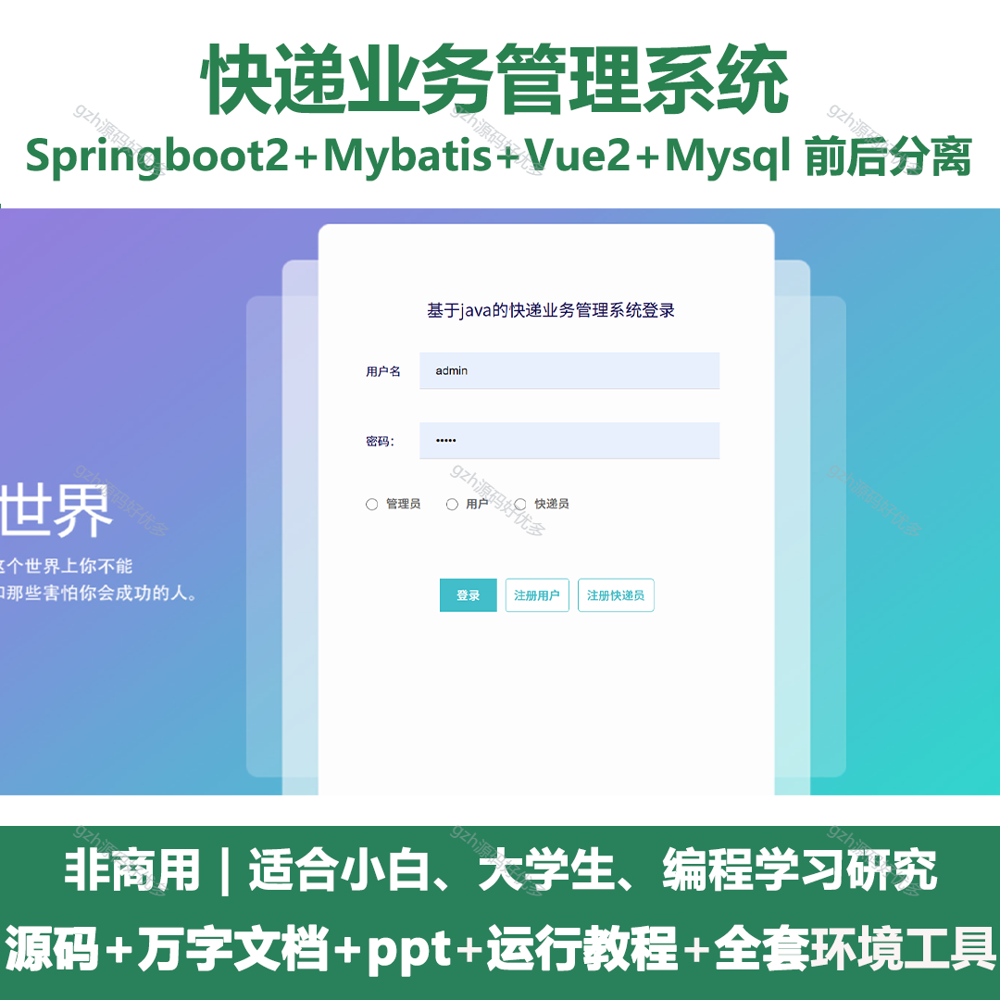
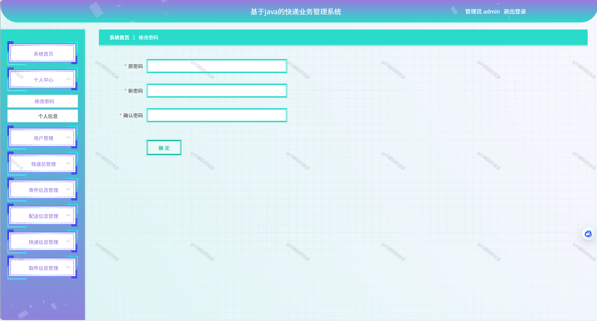
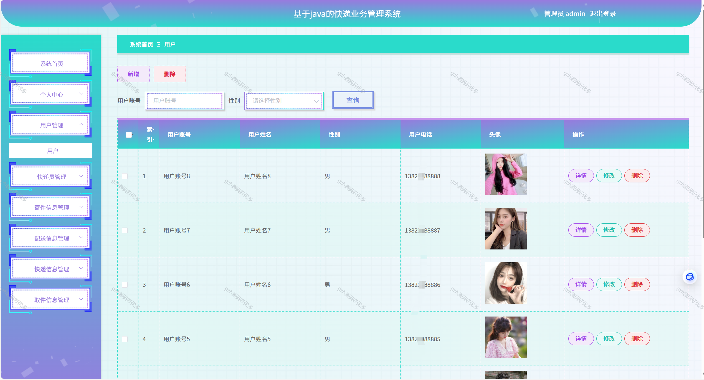
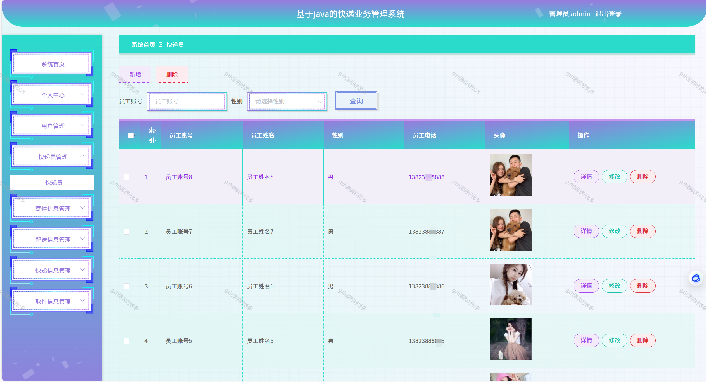
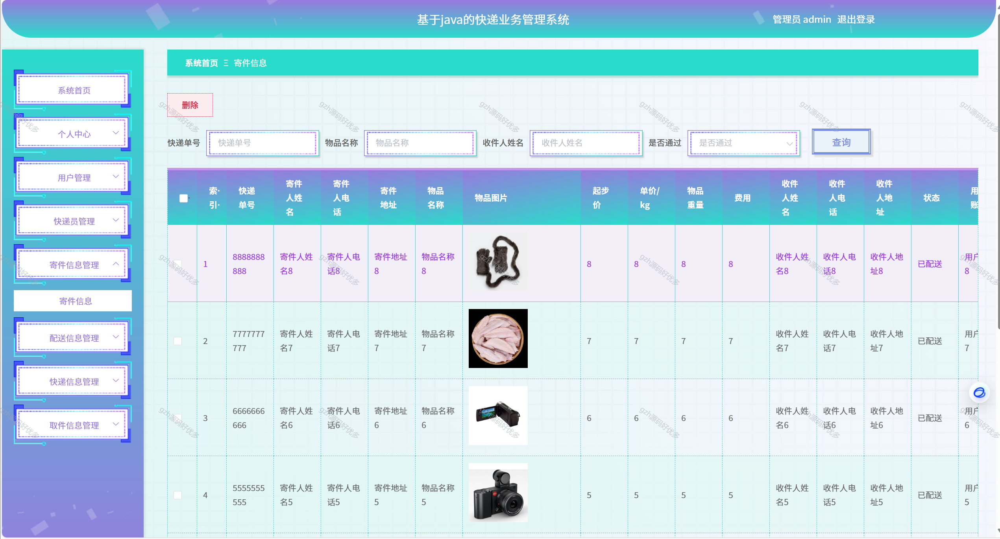
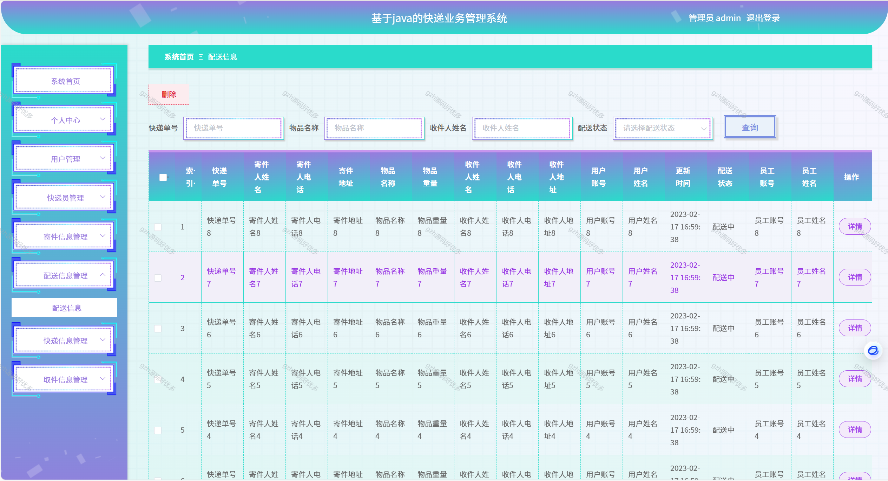
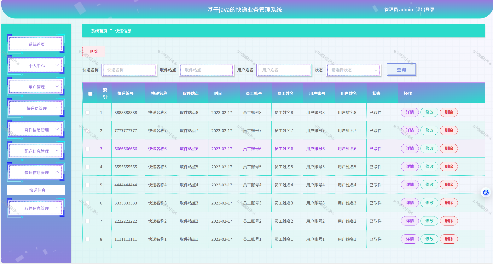
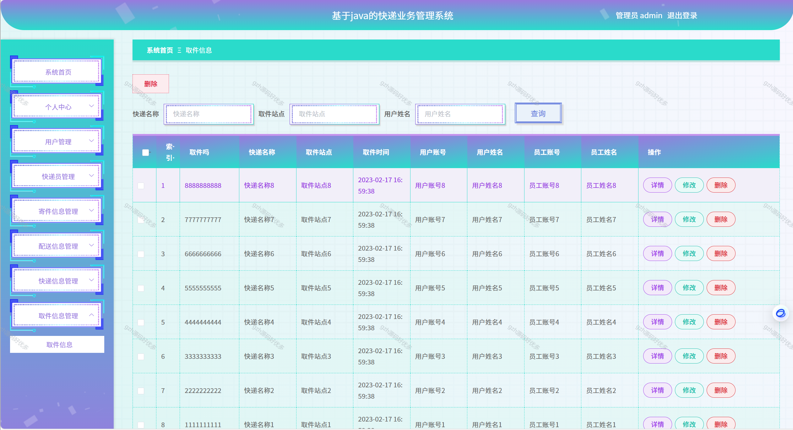
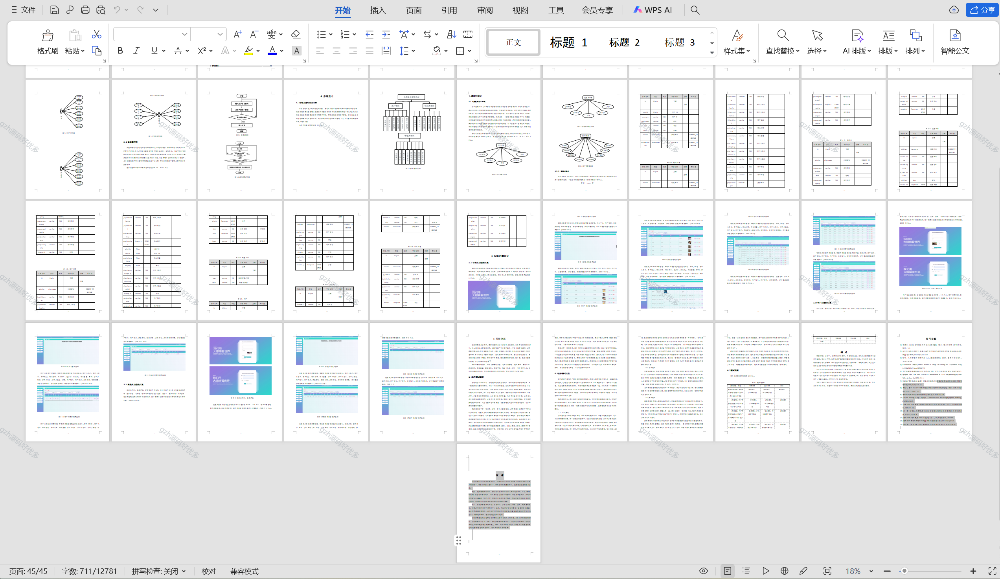

# springbootA269
springbootA269快递业务管理系统
 
## 查看主页获取源码

### 一、关键词
速递业务管理系统,物流快递管理系统,快递运营管理系统

### 二、作品包含
源码+数据库+设计文档万字+PPT+全套环境和工具资源+本地部署教程

### 三、项目技术
前端技术：Html、Css、Js、Vue2.0、Element-ui 
后端技术：Java、SpringBoot2.0、MyBatis

### 四、运行环境（以下版本亲测，其他版本兼容性请自行测试）
开发工具：IDEA/eclipse  + VSCODE

数据库：MySQL5.7（最低要5.7版本）

数据库管理工具：Navicat10以上版本

环境配置软件： JDK1.8 + Maven3.6.3

前端Nodejs：14

浏览器：谷歌浏览器

### 五、项目介绍
项目编号：springbootA269

相比于以前的传统手工管理方式，智能化的管理方式可以大幅降低快递站的运营人员成本，实现了快递业务的标准化、制度化、程序化的管理，有效地防止了快递业务的随意管理，提高了信息的处理速度和精确度，能够及时、准确地查询和修正寄件信息、配送信息、快递信息、取件信息等。
系统主要包括寄件信息、配送信息、快递信息、取件信息等功能，从而实现智能化的管理方式，提高工作效率。 

### 六、运行截图

